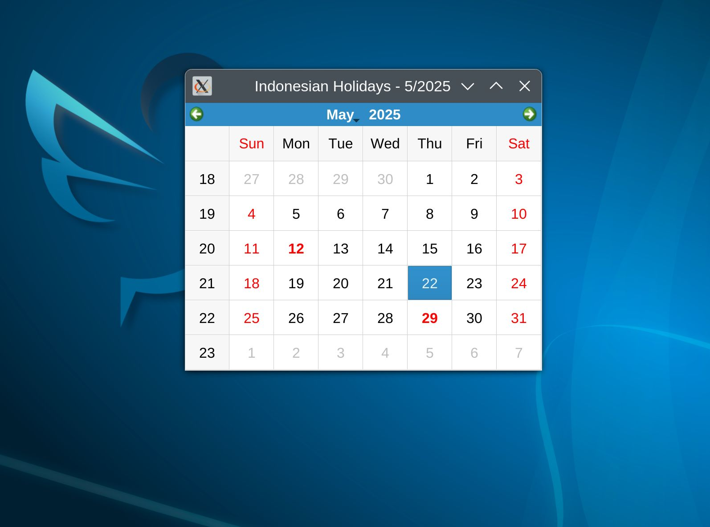

# LXQt Calendar Plugin - Kalender Indonesia dengan Highlight Hari Libur

Plugin kalender ini menampilkan kalender dengan hari libur Indonesia yang diambil dari API [https://api-harilibur.vercel.app/api](https://api-harilibur.vercel.app/api).  
Hari libur ditandai dengan teks **merah** dan **bold**.

---

## Fitur

- Tampilan GUI kalender berbasis Qt (Go + therecipe/qt)  
- Highlight hari libur Indonesia secara otomatis  
- Data hari libur realtime dari API  
- Ringan, cepat, kompatibel Qt5 dan Qt6  
- Mode debug untuk logging opsional  

---

## preview


## Prasyarat

- Go minimal versi 1.16  
- Qt5/Qt6 sudah terinstall  
- `therecipe/qt` sudah ter-setup (https://github.com/therecipe/qt)  
- Koneksi internet untuk ambil data hari libur  

---

## Compile Aplikasi

1. Clone repo:

    ```bash
    git clone https://github.com/papanlesat/lxqt-kalender.git
    cd lxqt-kalender
    ```

2. Aktifkan modul dan unduh dependensi:

    ```bash
    export GO111MODULE=on
    go mod tidy
    ```

3. Compile:

    ```bash
    go build -o idKalender
    ```

---

## Instalasi

### 1. Pasang binary ke sistem

```bash
sudo cp idKalender /usr/local/bin/
sudo chmod +x /usr/local/bin/idKalender
````

### 2. Buat file shortcut `.desktop`

Buat file `~/.local/share/applications/lxqt-kalender.desktop` dengan isi berikut:

```ini
[Desktop Entry]
Name=Kalender Indonesia LXQt
Comment=Plugin kalender dengan hari libur Indonesia
Exec=/usr/local/bin/idKalender
Icon=calendar
Terminal=false
Type=Application
Categories=Utility;Education;
StartupNotify=true
```

> **Catatan:**
>
> * Pastikan path `Exec` sesuai lokasi binary.
> * Icon bisa diganti dengan nama icon yang ada di sistem kamu atau custom.

### 3. Tambahkan ke Panel LXQt

* Klik kanan panel LXQt → `Add Widgets` → `Application Launch Bar`
* Tambahkan shortcut "Kalender Indonesia LXQt" dari menu aplikasi (shortcut `.desktop` tadi)

### 4. (Opsional) Jalankan Otomatis Saat Login

* Buka `LXQt Session Settings` → tab `Autostart`
* Klik `Add` → isi dengan `/usr/local/bin/idKalender`
* Simpan dan restart session LXQt

---

## Menjalankan Aplikasi

Jalankan langsung dari terminal:

```bash
calendar
```

atau dari menu aplikasi setelah membuat shortcut.

---

## Debug Mode

Untuk melihat log debug jalankan:

```bash
idKalender --debug
```

---

## Struktur Proyek

```
lxqt-kalender/
├─ go.mod
├─ main.go
├─ applier.go
├─ watcher.go
├─ README.md
```

---

## Lisensi

MIT License

---

## Kontak

Buat issue atau pull request di GitHub repository untuk pertanyaan dan kontribusi.
